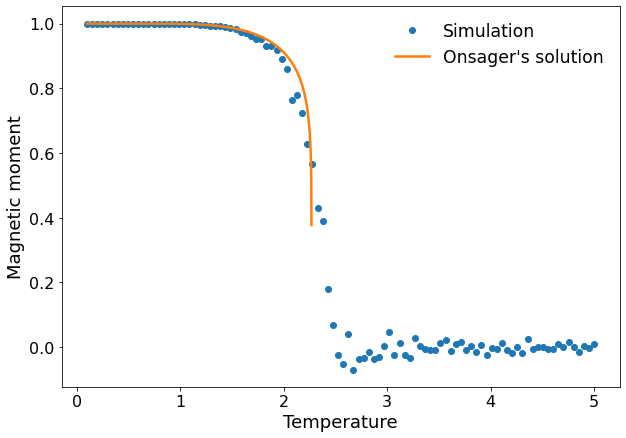
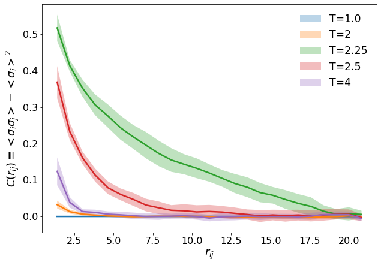

# Ising Model at Two Dimension

This repository hots a python implementation of the Ising model in 2 dimensions.

|  Magnetization(T) |  2-points correlation  |
|:-----------------:|:----------------------:|
|  | | 

The following shows a 500x500 spin lattice with some perturbations in the four corners.
Below the critical temperature, the domains where spins are aligned tend to grow while
they tend to disappear above the critical temperature.

|  T<Tc |  T>Tc  |
|:-----:|:------:|
|  |  |

